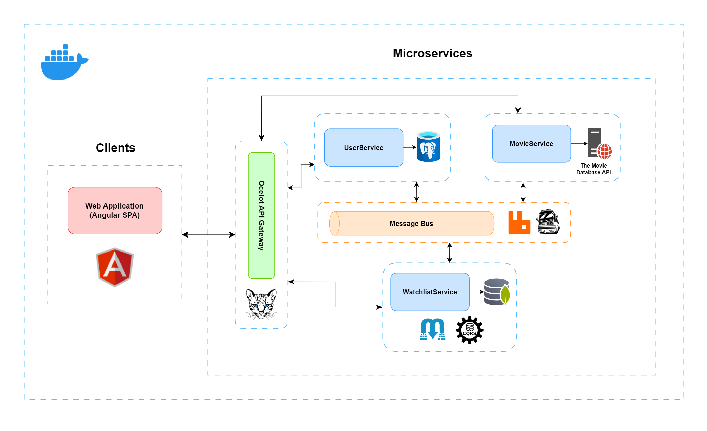

# Watchwise

This application is built using a microservices architecture following **Clean Architecture**, **CQRS** and **Mediator** patterns with communicating over **Event Driven Communication**.

---
## Table of Contents
1. [Introduction](#introduction)
2. [Features](#features)
3. [Technologies](#technologies)
4. [Architecture](#architecture)
5. [Installation](#installation)
6. [Usage](#usage)
7. [API Documentation](#api-documentation)
8. [Contributing](#contributing)
9. [License](#license)
---
## Introduction

The Watchwise is designed to provide users with a seamless experience to search information about movies, manage personalized watchlists, and receive recommendations based on their preferences. The application is structured using a microservices architecture to ensure scalability, maintainability, and flexibility in the development process. The application consists of 4 main components: **UserService**, **WatchlistService**, **MovieService**, and **WebClient**. The backend microservices (UserService, WatchlistService, and MovieService) are developed using **.NET** and the frontend (WebClient) is built using **Angular 16**.

---
## Features

- **Movie Search**: Users can search for movies and view detailed information about each movie.
- **Watchlists**: Users can create and manage personalized watchlists, adding or removing movies as they desire.
- **Watchlist Recommendations**: The application offers movie recommendations based on user preferences.
- **User Authentication**: Users can sign up and log in to access personalized features.
---
## Technologies

- [ASP.NET 7](https://dotnet.microsoft.com/en-us/apps/aspnet)
- [MediatR](https://github.com/jbogard/MediatR) - for implementing Mediator pattern.
- [Dapper](https://github.com/DapperLib/Dapper) - ORM
- [AutoMapper](https://automapper.org/) - for mapping between entities and DTOs.
- [RabbitMQ](https://www.rabbitmq.com/)
- [MassTransit](https://masstransit.io/)
- [FluentValidation](https://github.com/FluentValidation/FluentValidation) - for validating requests.
- [Language-ext](https://github.com/louthy/language-ext) - for handling errors.
- [Bcrypt]()
- [xUnit](https://github.com/xunit/xunit) - for unit testing.
- [Moq](https://github.com/moq/moq4) - for isolating dependencies in unit tests.
- [AutoFixture](https://github.com/AutoFixture/AutoFixture) - for generating test data in unit tests.
- [Docker](https://www.docker.com/) - for containerization
- [Docker Compose](https://docs.docker.com/compose/) - for managing containers
---
## Architecture

So, let's talk more about architecture of **Watchwise**. Here is a final architecture of the system:

- **UserService**: This microservice handles user authentication and user-related functionalities. It includes:
    - **ASP.NET Core Web API** application
    - Connection to containerized **PostgreSQL database**
    - REST API principles, CRUD operations
    - 3-Layered implementation
    - Repository pattern
    - **Dockerfile** and **docker-compose** implementation
    - Configurations for handling messages using **MassTransit** and **RabbitMQ** and sending response-messages

- **WatchlistService**: The Watchlist microservice is responsible for managing user watchlists. It allows users to create new watchlists, add or remove movies from existing watchlists.
    - **ASP.NET Core Web API** application
    - Connection to containerized **MongoDB database**
    - REST API principles, CRUD operations
    - Implementing **CQRS** and **Clean Architecture** principles
    - Developing **CQRS** using **MediatR** , **FluentValidation** and **AutoMapper** packages
    - Repository pattern
    - **Dockerfile** and **docker-compose** implementation
    - Configurations for sending, handling messages using **MassTransit** and **RabbitMQ**.

- **MovieService**: The Movie microservice provides movie-related functionalities, including movie search, retrieving detailed information about movies. It includes:
    - **ASP.NET Core Web API** application
    - Connection to **The Movie Database API (TMDB)**
    - REST API principles
    - **Dockerfile** and **docker-compose** implementation
    - Configurations for sending messages using **MassTransit** and **RabbitMQ**.

- **API Gateway**: The API Gateway is a central entry point for this application. It acts as an intermediary between the frontend WebUI and the backend microservices, providing a unified and simplified interface for the client-side applications to interact with the various services. The API Gateway includes:
    - Implementing API Gateway routing with **Ocelot**
    - Dockerfile and docker-compose implementation

- **WebUI**: The WebUI is the frontend component of the application, developed using **Angular 16**. It provides the user interface for users to interact with the application and consume data from the microservices. Key features of the WebUI include:
    - User Authentication: Allowing users to sign up, log in, and manage their accounts securely.
    - Movie Search: Enabling users to search for movies and view a list of relevant results based on their queries.
    - Movie Details: Displaying detailed information about selected movies, including ratings, budget, movie genres, trailers, similar movies etc.
    - Watchlist Management: Allowing users to create new watchlists and add/remove movies from their existing watchlists.
    - Interaction with Backend Services: Communicating with the API Gateway to access the backend microservices and retrieve data or perform actions.
    - Error Handling: Providing informative error messages and feedback to users in case of issues or failures

The combination of the API Gateway and WebUI allows for a seamless user experience, decoupling the frontend from the microservices complexity, and providing a scalable and maintainable architecture for the entire application.

---
## Installation